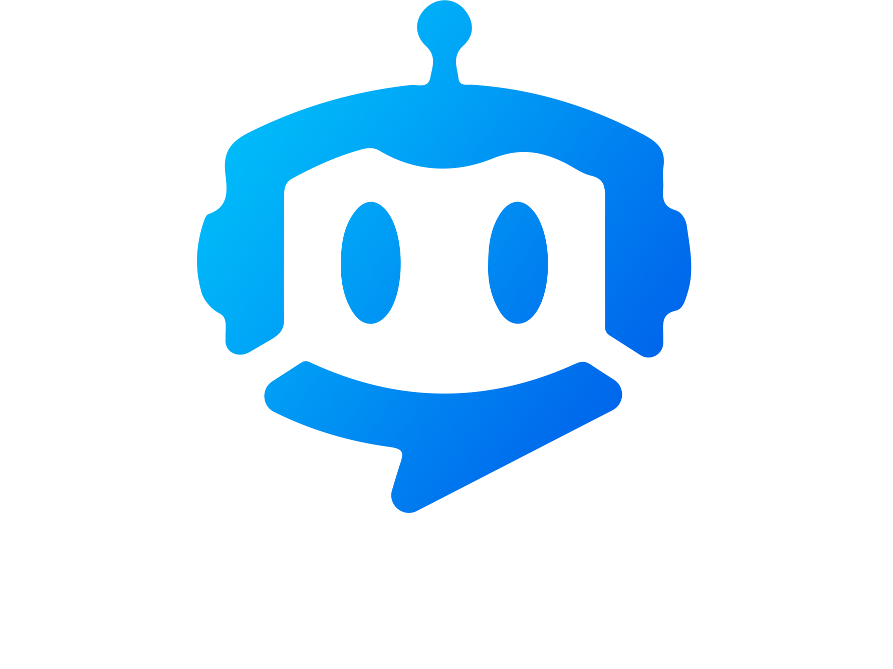

<div align="center">
    
</div>

# IntelliBot Chat 🤖💬

> AI-powered chatbot interface for the IntelliGuide ecosystem - bringing intelligent conversation to event visitors

## 📋 Project Overview

IntelliBot Chat is an interactive web-based chatbot application developed as part of a first-semester project at **Fontys ICT Eindhoven**. This application serves as the visitor-facing interface for IntelliGuide robots - AI-powered assistants that provide intelligent support and information to event attendees.

The chatbot enables event visitors to:
- 💬 **Engage in natural conversations** with AI-powered event assistants
- 🔍 **Get instant answers** to event-related questions
- 🎤 **Use voice interaction** with text-to-speech and speech recognition
- ⭐ **Provide feedback** through conversation ratings
- 🆘 **Request human assistance** when needed
- 📱 **Access from any device** with a responsive web interface

## 🔗 Related Repositories

This chatbot is part of the larger IntelliGuide ecosystem:

- **[Daanylo/intelliGuide-API](https://github.com/Daanylo/intelliGuide-API)** - Backend API providing bot data and conversation management
- **[Daanylo/intelliGuide-Dashboard](https://github.com/Daanylo/intelliGuide-Dashboard)** - Management dashboard for configuring and monitoring bots

## 🏗️ Project Architecture

### Technology Stack
- **Framework**: ASP.NET Core 8.0 (C#) with MVC pattern
- **Frontend**: Razor Pages with Bootstrap 5 and custom CSS/JavaScript
- **Speech Services**: Azure Cognitive Services (Text-to-Speech)
- **AI Integration**: OpenAI GPT models for natural language processing
- **Session Management**: ASP.NET Core session state
- **Real-time Features**: SignalR for live conversation updates

### Key Features
- 🎨 **Modern Chat Interface** - Sleek, responsive design with smooth animations
- 🤖 **AI-Powered Responses** - Integration with OpenAI for intelligent conversations
- 🎤 **Voice Interaction** - Text-to-speech output and speech recognition input
- 📱 **Mobile-First Design** - Optimized for tablets and mobile devices (robot interface)
- 💾 **Conversation Persistence** - All interactions saved for analytics and review
- ⭐ **Rating System** - Visitor feedback collection for continuous improvement
- 🔒 **Session Security** - Secure authentication and data protection

## 🚀 Getting Started

### Prerequisites
- .NET 8.0 SDK or later
- Visual Studio 2022 or VS Code
- Azure Speech Services subscription (for TTS)
- OpenAI API key
- Access to IntelliGuide API

### Installation

1. **Clone the repository**
   ```bash
   git clone <repository-url>
   cd intelliBot-Chat
   ```

2. **Install dependencies**
   ```bash
   dotnet restore
   ```

3. **Configure environment**
   ```bash
   # Copy template files and configure with your API keys
   Copy-Item appsettings.Development.template.json appsettings.Development.json
   Copy-Item appsettings.Production.template.json appsettings.Production.json
   ```

4. **Update configuration**
   Edit `appsettings.Development.json` with your API keys:
   ```json
   {
     "AzureSpeech": {
       "SubscriptionKey": "your-azure-speech-key",
       "Region": "westeurope"
     },
     "intelliGuide": {
       "ApiAddress": "http://localhost:3000",
       "ApiKey": "your-intelliguide-api-key"
     },
     "OpenAI": {
       "ApiKey": "your-openai-api-key"
     }
   }
   ```

5. **Start the IntelliGuide API**
   ```bash
   # In the intelliGuide-API directory
   npm start
   ```

6. **Run the chatbot**
   ```bash
   dotnet run
   ```

7. **Access the application**
   - Open your browser and navigate to `http://localhost:5000`
   - Select or configure a bot to start chatting

### Configuration

See `CONFIGURATION.md` for detailed setup instructions including:
- API key configuration
- Environment setup options
- Security best practices

## 📁 Project Structure

```
intelliBot-Chat/
├── Controllers/              # MVC Controllers
│   ├── AuthenticationController.cs  # Bot authentication
│   ├── BotController.cs             # Bot data management
│   ├── ConversationController.cs    # Chat logic
│   ├── OpenAIController.cs          # AI integration
│   ├── TextToSpeechController.cs    # Voice features
│   └── ReviewController.cs          # Feedback system
├── Models/                   # Data models
│   ├── Bot.cs               # Bot configuration
│   ├── Conversation.cs      # Chat sessions
│   ├── Message.cs           # Chat messages
│   ├── Context.cs           # Bot knowledge
│   └── Review.cs            # Feedback data
├── Views/                   # Razor views
│   ├── Conversation/        # Chat interface
│   ├── Index/               # Landing pages
│   ├── Review/              # Feedback forms
│   └── Shared/              # Layout templates
├── wwwroot/                 # Static assets
│   ├── css/                 # Stylesheets
│   ├── js/                  # JavaScript files
│   └── resources/           # Images and assets
├── appsettings.*.json       # Configuration files
└── Program.cs               # Application startup
```

## 🎯 Key Features

### Chat Interface
- **Real-time messaging** with smooth animations
- **Typing indicators** for natural conversation flow
- **Message history** with persistent conversation state
- **Responsive design** for various screen sizes

### AI Integration
- **OpenAI GPT models** for intelligent responses
- **Context-aware conversations** using bot knowledge base
- **Personalized responses** based on bot configuration
- **Fallback handling** for unsupported queries

### Voice Features
- **Text-to-Speech** using Azure Cognitive Services
- **Multiple voice options** with customizable settings
- **Speech rate and pitch control** for natural delivery
- **Cross-browser compatibility** for audio playback

### Analytics & Feedback
- **Conversation tracking** for performance analysis
- **Rating system** for visitor satisfaction
- **Help request submission** for human intervention
- **Usage analytics** for continuous improvement

## 🎨 User Interface

### Chat Experience
- Clean, modern design with intuitive controls
- Smooth message animations and transitions
- Clear distinction between user and bot messages
- Easy access to voice features and settings

### Responsive Design
Optimized for multiple device types:
- 🖥️ **Desktop browsers** - Full feature experience
- 📱 **Tablets** - Primary target for robot interfaces
- 📲 **Mobile devices** - Compact, touch-friendly layout

## 🔒 Security Features

- **Session-based authentication** - Secure bot access control
- **API key protection** - Encrypted communication with services
- **Data validation** - Input sanitization and validation
- **HTTPS enforcement** - Secure data transmission
- **Session timeout** - Automatic security cleanup

## 🛠️ Development

### Running in Development
```bash
# Run with hot reload
dotnet watch run

# Run specific environment
dotnet run --environment Development
```

### Building for Production
```bash
# Build release version
dotnet build --configuration Release

# Publish for deployment
dotnet publish --configuration Release --output ./publish
```

### Available Scripts
```bash
# Start development server
dotnet run

# Run with file watching
dotnet watch run

# Clean build artifacts
dotnet clean

# Restore packages
dotnet restore
```

## 📊 API Integration

### IntelliGuide API Endpoints Used
- **Authentication** - Bot login and session management
- **Bot Configuration** - Retrieve bot settings and personality
- **Conversations** - Save and retrieve chat history
- **Messages** - Store individual chat messages
- **Context** - Access bot knowledge base
- **Reviews** - Submit visitor feedback

### External Services
- **OpenAI API** - Natural language processing and generation
- **Azure Speech Services** - Text-to-speech functionality
- **IntelliGuide API** - Bot data and conversation management

## 🎓 Educational Context

This project was developed as part of the curriculum at **Fontys ICT Eindhoven** during the first semester. It demonstrates:

- **Full-Stack Web Development** - Complete MVC application with modern UI
- **API Integration** - Multiple external service integrations
- **Real-time Features** - Live chat with voice capabilities
- **Responsive Design** - Multi-device user experience
- **AI Integration** - Natural language processing implementation
- **Security Implementation** - Session management and data protection

## 🚀 Deployment

### Production Considerations
- Configure HTTPS with valid SSL certificates
- Set up secure API key management
- Enable logging and monitoring
- Configure database connection strings
- Set up automated backup procedures

### Environment Variables
```bash
# Required for production
ASPNETCORE_ENVIRONMENT=Production
ASPNETCORE_URLS=https://+:443;http://+:80
```

## 🤝 Contributing

This is an educational project. For development:
1. Maintain the existing MVC architecture
2. Follow C# coding conventions
3. Ensure responsive design principles
4. Test with multiple browsers and devices
5. Update documentation for new features

## 📄 License

This project was created for educational purposes at Fontys ICT Eindhoven.

## 🙏 Acknowledgments

- **Fontys ICT Eindhoven** - Educational institution and project framework
- **IntelliGuide Team** - Collaborative ecosystem development
- **Azure Cognitive Services** - Speech and AI capabilities
- **OpenAI** - Natural language processing
- **Event Industry Partners** - Real-world use case validation

---

*Part of the IntelliGuide ecosystem - Intelligent conversation interfaces for modern events* 🚀

## 🔗 Ecosystem Overview

```
┌─────────────────────┐    ┌──────────────────────┐    ┌─────────────────────┐
│   IntelliGuide      │    │   IntelliGuide       │    │   IntelliBot        │
│   Dashboard         │◄──►│   API                │◄──►│   Chat              │
│   (Management)      │    │   (Data Backend)     │    │   (Visitor Interface)│
└─────────────────────┘    └──────────────────────┘    └─────────────────────┘
        │                            │                            │
        ▼                            ▼                            ▼
   Event Organizers              Centralized Data           Event Visitors
   - Configure bots              - Bot configurations       - Chat with AI
   - Monitor performance         - Conversation history     - Voice interaction
   - Manage events               - User management          - Rate experience
   - Review analytics            - Context data             - Request help
```

<div align="center">
    
</div>
